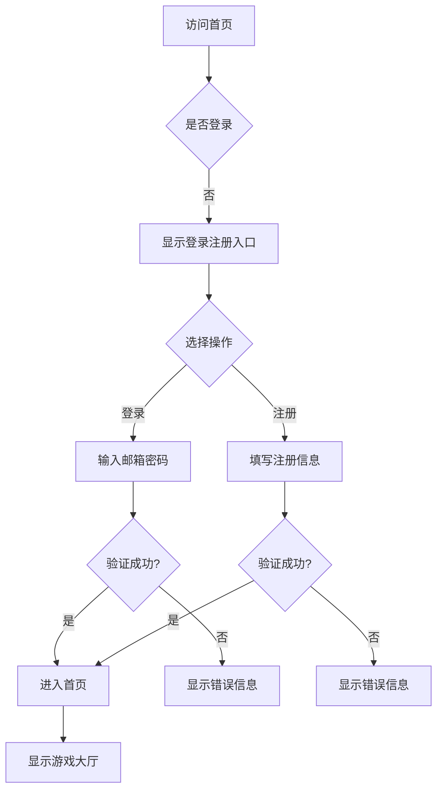
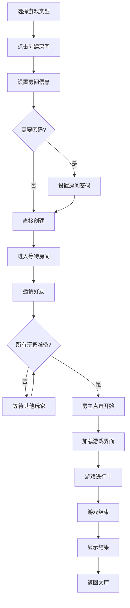
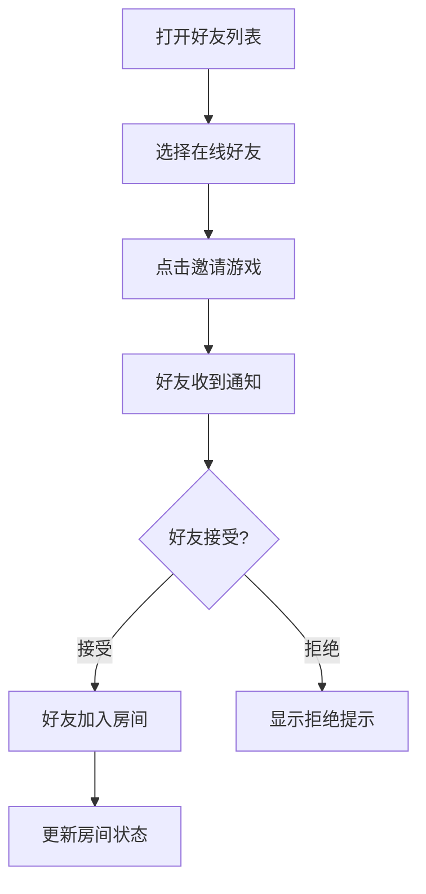

# 在线桌游平台产品需求文档

## 1. 产品概述

一个支持多游戏、可扩展的在线桌游平台，用户可与朋友远程联机进行五子棋、飞行棋等桌游娱乐。

- **核心目的**：构建插件化游戏平台，支持未来快速接入新游戏
- **目标用户**：喜欢和朋友远程联机玩桌游的玩家
- **产品价值**：提供流畅的实时联机体验，降低联机玩桌游的门槛

## 2. 核心功能

### 2.1 用户角色

| 角色 | 注册方式 | 核心权限 |
|------|----------|----------|
| 普通用户 | 邮箱注册 | 浏览、创建房间、邀请好友、进行游戏 |

### 2.2 功能模块

1. **首页**：游戏选择、热门房间、在线好友、快速匹配入口
2. **用户中心**：个人资料、头像编辑、游戏记录、胜率统计
3. **好友系统**：搜索好友、添加/删除、在线状态、发送邀请
4. **房间系统**：创建房间、设置密码、邀请好友、准备/开始游戏
5. **游戏大厅**：五子棋、飞行棋（后续版本扩展）
6. **游戏界面**：实时对弈、聊天、观战

### 2.3 页面详情

| 页面名称 | 模块名称 | 功能描述 |
|----------|----------|----------|
| 首页 | 导航栏 | Logo、用户头像、消息入口、设置 |
| 首页 | 游戏选择区 | 展示可用游戏（带图标、难度标签） |
| 首页 | 热门房间 | 快速加入按钮、房间人数、状态 |
| 首页 | 在线好友 | 头像、状态气泡、邀请按钮 |
| 登录页 | 登录表单 | 邮箱、密码、记住登录、忘记密码 |
| 登录页 | 注册入口 | 邮箱、用户名、密码、确认密码 |
| 用户中心 | 个人信息卡 | 头像、用户名、邮箱、注册时间 |
| 用户中心 | 游戏统计 | 总场次、胜率、最近战绩 |
| 用户中心 | 设置面板 | 修改密码、修改头像、退出登录 |
| 好友列表 | 好友管理 | 搜索框、好友列表（分组：在线/离线/游戏中） |
| 好友列表 | 好友详情 | 发送消息、邀请游戏、删除好友 |
| 房间列表 | 房间大厅 | 筛选条件、房间列表、创建房间按钮 |
| 房间详情 | 房间信息 | 房间号、密码状态、游戏类型、房主 |
| 房间详情 | 玩家区域 | 玩家卡片、准备状态、座位布局 |
| 房间详情 | 聊天区域 | 公屏聊天、玩家消息 |
| 房间详情 | 房主控制 | 开始游戏、踢人、修改设置、解散房间 |
| 五子棋界面 | 棋盘 | 15x15网格、落子动画、回合提示 |
| 五子棋界面 | 侧边栏 | 当前玩家、计时器、投降按钮、聊天 |
| 飞行棋界面 | 棋盘 | 4色赛道、骰子区域、玩家位置 |
| 飞行棋界面 | 操作区 | 骰子按钮、飞机选择、回合信息 |
| 游戏结果 | 结果展示 | 胜负状态、复盘按钮、返回大厅 |

## 3. 核心流程

### 3.1 用户注册登录流程

### 3.2 创建房间并开始游戏流程

### 3.3 好友邀请流程

## 4. 用户界面设计

### 4.1 设计风格

- **设计理念**：现代简约 + 桌游趣味性
- **主色调**：深蓝 `#1a237e`（信任感）与 金色 `#ffc107`（游戏乐趣）
- **辅助色**：
  - 成功绿 `#4caf50`
  - 警告橙 `#ff9800`
  - 错误红 `#f44336`
  - 背景深灰 `#121212`
  - 卡片浅灰 `#1e1e1e`
- **按钮风格**：圆角按钮（border-radius: 8px），悬停时微微上浮
- **字体**：
  - 标题：`"Poppins", "Noto Sans SC", sans-serif`
  - 正文：`"Inter", "Noto Sans SC", sans-serif`
- **布局风格**：卡片式布局，顶部固定导航，侧边栏可折叠
- **图标风格**：线性图标（Lucide React），统一 stroke-width: 2

### 4.2 页面设计概览

| 页面名称 | 模块名称 | UI元素 |
|----------|----------|--------|
| 首页 | 导航栏 | 固定顶部，毛玻璃效果背景，Logo左侧，导航居中，用户信息右侧 |
| 首页 | 游戏卡片 | 悬停放大效果，游戏图标，名称，难度标签（初级/中级/高级） |
| 首页 | 房间预览卡 | 房间名，房间号，人数指示器，状态徽章，加入按钮 |
| 登录注册 | 表单卡片 | 居中卡片，表单字段，验证提示，渐变背景装饰 |
| 用户中心 | 信息卡 | 头像框（圆形，带状态指示器），数据统计卡片网格 |
| 好友列表 | 好友项 | 头像，昵称，状态徽章（绿点/灰点/游戏图标），操作按钮组 |
| 房间界面 | 玩家座位 | 卡片布局，显示准备状态，支持拖拽座位 |
| 游戏界面 | 游戏棋盘 | 中央区域，清晰网格，功能按钮侧边栏 |

### 4.3 响应式设计

- **桌面优先**：针对1920x1080优化，兼容1366x768
- **平板适配**：1024px以下侧边栏收起，布局堆叠
- **移动端适配**：
  - 768px以下：底部Tab导航，简化界面
  - 触控优化：按钮尺寸 ≥ 44px，间距充足
- **横屏模式**：游戏界面优先横屏体验

### 4.4 动画与交互

- **页面切换**：淡入淡出 + 轻微位移（300ms ease-out）
- **按钮交互**：hover缩放1.05，active缩小0.95
- **列表项**：stagger入场动画，间隔50ms
- **游戏落子**：弹性动画 + 涟漪效果
- **通知提示**：slide-in从右侧滑入
- **加载状态**：骨架屏 + 脉冲动画
