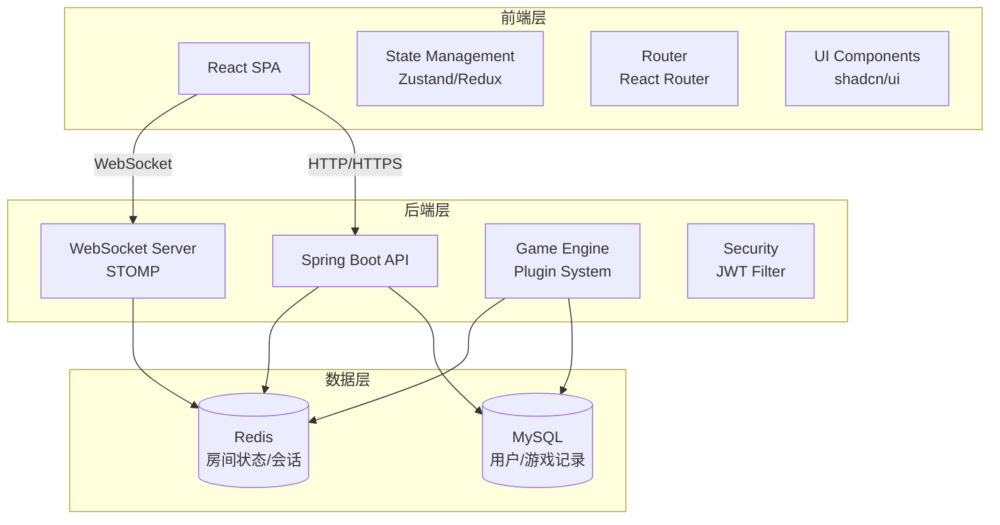
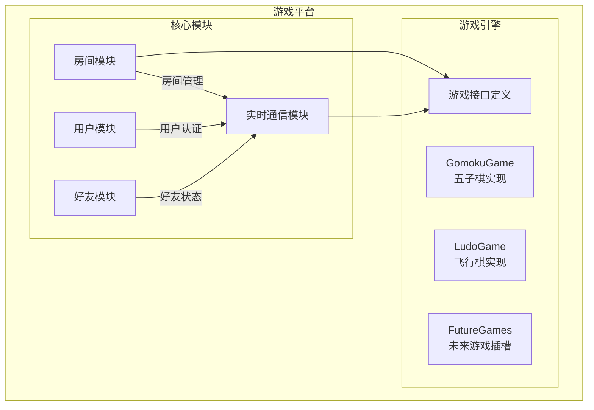
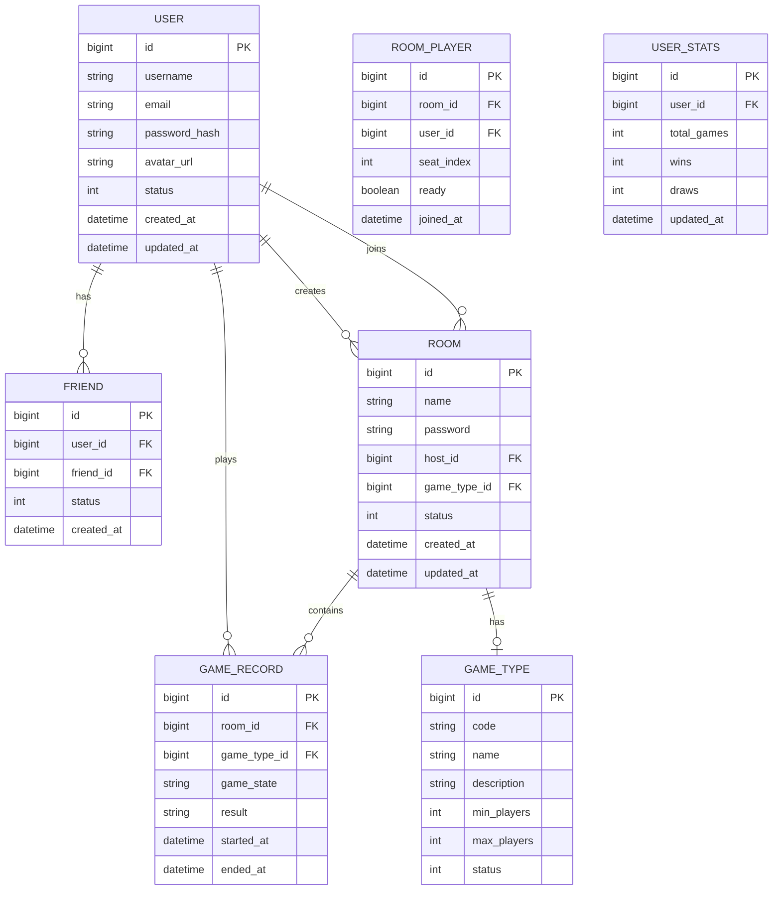
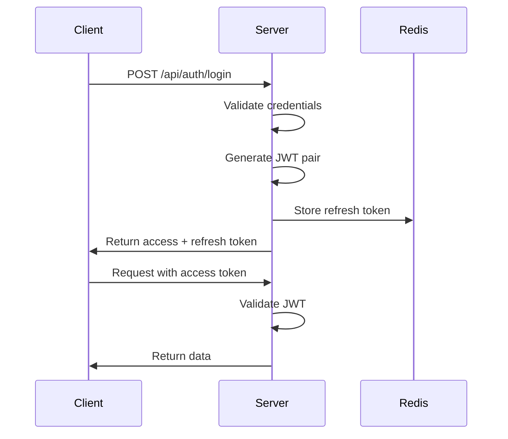
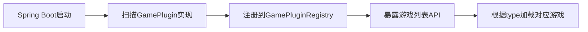
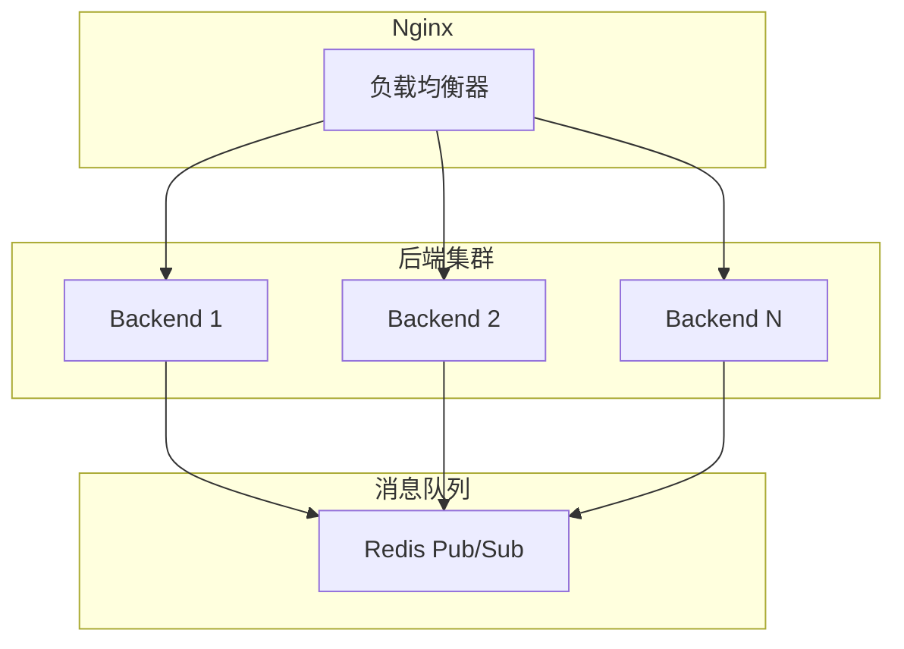

# 在线桌游平台技术架构文档

## 1. 架构设计

### 1.1 整体架构



### 1.2 模块架构



## 2. 技术选型

### 2.1 前端技术栈

| 技术 | 版本 | 用途 |
|------|------|------|
| React | 18.3+ | UI框架 |
| TypeScript | 5.0+ | 类型安全 |
| Vite | 5.0+ | 构建工具 |
| TailwindCSS | 3.4+ | 样式框架 |
| shadcn/ui | latest | 组件库 |
| Zustand | 4.5+ | 状态管理 |
| React Router | 6.0+ | 路由管理 |
| Socket.io-client | 4.7+ | WebSocket客户端 |
| React Query | 5.0+ | 数据获取 |
| Zod | 3.0+ | 数据验证 |

### 2.2 后端技术栈

| 技术 | 版本 | 用途 |
|------|------|------|
| Java | 21 | 运行环境 |
| Spring Boot | 3.2+ | Web框架 |
| Spring Security | 6.0+ | 安全认证 |
| Spring WebSocket | 6.0+ | 实时通信 |
| JWT | 0.12+ | Token认证 |
| MyBatis-Plus | 3.5+ | ORM框架 |
| MySQL | 8.0+ | 主数据库 |
| Redis | 7.0+ | 缓存/会话 |
| Lombok | 1.18+ | 代码简化 |

### 2.3 开发工具

| 工具 | 用途 |
|------|------|
| Docker | 容器化部署 |
| Maven | 项目构建 |
| Git | 版本控制 |
| ESLint | 前端代码检查 |
| Prettier | 代码格式化 |

## 3. 路由定义

### 3.1 前端路由

| 路径 | 页面组件 | 权限要求 |
|------|----------|----------|
| `/` | 首页/大厅 | 需登录 |
| `/login` | 登录页 | 游客 |
| `/register` | 注册页 | 游客 |
| `/profile` | 用户中心 | 需登录 |
| `/friends` | 好友列表 | 需登录 |
| `/rooms` | 房间列表 | 需登录 |
| `/room/:id` | 房间详情 | 需登录 |
| `/game/:type/:id` | 游戏界面 | 需登录 |
| `/settings` | 设置页 | 需登录 |

### 3.2 后端API路由

#### 认证模块 `/api/auth`

| 方法 | 路径 | 描述 |
|------|------|------|
| POST | `/api/auth/register` | 用户注册 |
| POST | `/api/auth/login` | 用户登录 |
| POST | `/api/auth/logout` | 用户登出 |
| POST | `/api/auth/refresh` | 刷新Token |
| POST | `/api/auth/forgot-password` | 忘记密码 |
| POST | `/api/auth/reset-password` | 重置密码 |

#### 用户模块 `/api/users`

| 方法 | 路径 | 描述 |
|------|------|------|
| GET | `/api/users/me` | 获取当前用户信息 |
| PUT | `/api/users/me` | 更新个人信息 |
| PUT | `/api/users/me/avatar` | 更新头像 |
| PUT | `/api/users/me/password` | 修改密码 |
| GET | `/api/users/:id` | 获取指定用户信息 |
| GET | `/api/users/:id/stats` | 获取用户统计数据 |

#### 好友模块 `/api/friends`

| 方法 | 路径 | 描述 |
|------|------|------|
| GET | `/api/friends` | 获取好友列表 |
| POST | `/api/friends/request` | 发送好友请求 |
| PUT | `/api/friends/request/:id` | 处理好友请求 |
| DELETE | `/api/friends/:id` | 删除好友 |
| GET | `/api/friends/requests` | 获取好友请求列表 |

#### 房间模块 `/api/rooms`

| 方法 | 路径 | 描述 |
|------|------|------|
| GET | `/api/rooms` | 获取房间列表 |
| POST | `/api/rooms` | 创建房间 |
| GET | `/api/rooms/:id` | 获取房间详情 |
| PUT | `/api/rooms/:id` | 更新房间信息 |
| DELETE | `/api/rooms/:id` | 解散房间 |
| POST | `/api/rooms/:id/join` | 加入房间 |
| POST | `/api/rooms/:id/leave` | 离开房间 |
| POST | `/api/rooms/:id/ready` | 准备/取消准备 |
| POST | `/api/rooms/:id/start` | 开始游戏 |
| POST | `/api/rooms/:id/invite` | 邀请好友 |

#### 游戏模块 `/api/games`

| 方法 | 路径 | 描述 |
|------|------|------|
| GET | `/api/games/types` | 获取游戏类型列表 |
| GET | `/api/games/history` | 获取游戏记录 |
| GET | `/api/games/:id` | 获取游戏详情 |

## 4. WebSocket消息定义

### 4.1 连接端点

```
ws://server/ws?token={jwt_token}
```

### 4.2 消息格式

```typescript
interface WSMessage {
  type: string;      // 消息类型
  payload: any;       // 消息内容
  timestamp: number;  // 时间戳
}

interface WSMessageType {
  // 房间相关
  'ROOM_JOIN': { roomId: string; userId: string };
  'ROOM_LEAVE': { roomId: string; userId: string };
  'ROOM_READY': { roomId: string; userId: string; ready: boolean };
  'ROOM_START': { roomId: string };
  'ROOM_STATE': { room: Room };

  // 游戏相关
  'GAME_ACTION': { gameId: string; action: GameAction };
  'GAME_STATE': { gameId: string; state: GameState };
  'GAME_END': { gameId: string; result: GameResult };

  // 聊天相关
  'CHAT_MESSAGE': { roomId: string; message: ChatMessage };

  // 好友相关
  'FRIEND_STATUS': { userId: string; status: UserStatus };
  'GAME_INVITE': { fromUser: User; roomId: string };

  // 系统消息
  'ERROR': { code: string; message: string };
  'PING': {};
  'PONG': {};
}
```

## 5. 数据模型

### 5.1 ER图



### 5.2 数据定义语言（DDL）

```sql
-- 用户表
CREATE TABLE users (
    id BIGINT PRIMARY KEY AUTO_INCREMENT,
    username VARCHAR(50) NOT NULL UNIQUE,
    email VARCHAR(100) NOT NULL UNIQUE,
    password_hash VARCHAR(255) NOT NULL,
    avatar_url VARCHAR(500),
    status TINYINT DEFAULT 0 COMMENT '0-offline, 1-online, 2-in-game',
    created_at TIMESTAMP DEFAULT CURRENT_TIMESTAMP,
    updated_at TIMESTAMP DEFAULT CURRENT_TIMESTAMP ON UPDATE CURRENT_TIMESTAMP,
    INDEX idx_username (username),
    INDEX idx_email (email),
    INDEX idx_status (status)
);

-- 好友关系表
CREATE TABLE friends (
    id BIGINT PRIMARY KEY AUTO_INCREMENT,
    user_id BIGINT NOT NULL,
    friend_id BIGINT NOT NULL,
    status TINYINT DEFAULT 0 COMMENT '0-pending, 1-accepted',
    created_at TIMESTAMP DEFAULT CURRENT_TIMESTAMP,
    FOREIGN KEY (user_id) REFERENCES users(id) ON DELETE CASCADE,
    FOREIGN KEY (friend_id) REFERENCES users(id) ON DELETE CASCADE,
    UNIQUE KEY uk_friend (user_id, friend_id),
    INDEX idx_user_id (user_id),
    INDEX idx_friend_id (friend_id)
);

-- 游戏类型表
CREATE TABLE game_types (
    id BIGINT PRIMARY KEY AUTO_INCREMENT,
    code VARCHAR(50) NOT NULL UNIQUE,
    name VARCHAR(100) NOT NULL,
    description TEXT,
    min_players INT NOT NULL,
    max_players INT NOT NULL,
    status TINYINT DEFAULT 1 COMMENT '0-disabled, 1-enabled',
    created_at TIMESTAMP DEFAULT CURRENT_TIMESTAMP
);

-- 房间表
CREATE TABLE rooms (
    id BIGINT PRIMARY KEY AUTO_INCREMENT,
    name VARCHAR(100) NOT NULL,
    password VARCHAR(255),
    host_id BIGINT NOT NULL,
    game_type_id BIGINT NOT NULL,
    status TINYINT DEFAULT 0 COMMENT '0-waiting, 1-ready, 2-playing, 3-ended',
    created_at TIMESTAMP DEFAULT CURRENT_TIMESTAMP,
    updated_at TIMESTAMP DEFAULT CURRENT_TIMESTAMP ON UPDATE CURRENT_TIMESTAMP,
    FOREIGN KEY (host_id) REFERENCES users(id) ON DELETE CASCADE,
    FOREIGN KEY (game_type_id) REFERENCES game_types(id),
    INDEX idx_status (status),
    INDEX idx_game_type (game_type_id)
);

-- 房间玩家表
CREATE TABLE room_players (
    id BIGINT PRIMARY KEY AUTO_INCREMENT,
    room_id BIGINT NOT NULL,
    user_id BIGINT NOT NULL,
    seat_index INT NOT NULL,
    ready BOOLEAN DEFAULT FALSE,
    joined_at TIMESTAMP DEFAULT CURRENT_TIMESTAMP,
    FOREIGN KEY (room_id) REFERENCES rooms(id) ON DELETE CASCADE,
    FOREIGN KEY (user_id) REFERENCES users(id) ON DELETE CASCADE,
    UNIQUE KEY uk_room_user (room_id, user_id),
    INDEX idx_room_id (room_id)
);

-- 游戏记录表
CREATE TABLE game_records (
    id BIGINT PRIMARY KEY AUTO_INCREMENT,
    room_id BIGINT NOT NULL,
    game_type_id BIGINT NOT NULL,
    game_state JSON,
    result JSON,
    started_at TIMESTAMP,
    ended_at TIMESTAMP,
    created_at TIMESTAMP DEFAULT CURRENT_TIMESTAMP,
    FOREIGN KEY (room_id) REFERENCES rooms(id) ON DELETE CASCADE,
    FOREIGN KEY (game_type_id) REFERENCES game_types(id),
    INDEX idx_room_id (room_id),
    INDEX idx_game_type (game_type_id)
);

-- 用户统计表
CREATE TABLE user_stats (
    id BIGINT PRIMARY KEY AUTO_INCREMENT,
    user_id BIGINT NOT NULL UNIQUE,
    total_games INT DEFAULT 0,
    wins INT DEFAULT 0,
    draws INT DEFAULT 0,
    updated_at TIMESTAMP DEFAULT CURRENT_TIMESTAMP ON UPDATE CURRENT_TIMESTAMP,
    FOREIGN KEY (user_id) REFERENCES users(id) ON DELETE CASCADE
);

-- 初始化游戏类型数据
INSERT INTO game_types (code, name, description, min_players, max_players) VALUES
('gomoku', '五子棋', '经典双人对弈游戏', 2, 2),
('ludo', '飞行棋', '四人休闲桌游', 2, 4);
```

### 5.3 Redis数据结构

```
# 用户在线状态
user:online:{userId} -> {status: "online"|"offline"|"in_game", lastSeen: timestamp}
TTL: 30分钟（心跳维持）

# 房间状态
room:{roomId} -> {
  id, name, password, hostId, gameType, status,
  players: [{userId, username, avatar, ready, seatIndex}],
  createdAt
}
TTL: 游戏结束后1小时

# 用户当前房间
user:room:{userId} -> roomId
TTL: 用户离开房间时删除

# WebSocket会话
session:{userId} -> connectionId
TTL: 连接断开时删除

# JWT黑名单
jwt:blacklist:{tokenId} -> "1"
TTL: token过期时间
```

## 6. 安全设计

### 6.1 认证流程



### 6.2 安全措施

| 安全措施 | 实现方式 |
|----------|----------|
| 密码加密 | BCrypt（强度因子12） |
| JWT认证 | Access Token（15分钟）+ Refresh Token（7天） |
| 防止CSRF | SameSite Cookie + CSRF Token |
| 输入验证 | 后端JSR-303 + 前端Zod双重验证 |
| 防止暴力破解 | 登录限流（5次/分钟）+ 验证码 |
| 房间权限 | 房主验证 + 密码校验 |
| 游戏防作弊 | 服务端游戏状态验证 + 操作签名 |

## 7. 游戏插件化设计

### 7.1 游戏接口定义

```java
public interface GamePlugin {
    
    // 获取游戏标识
    String getGameCode();
    
    // 获取游戏名称
    String getGameName();
    
    // 获取最少玩家数
    int getMinPlayers();
    
    // 获取最多玩家数
    int getMaxPlayers();
    
    // 创建游戏实例
    Game createGame(List<Long> playerIds);
    
    // 处理玩家操作
    GameResult handleAction(Game game, PlayerAction action);
    
    // 检查游戏结果
    GameResult checkResult(Game game);
    
    // 序列化游戏状态
    String serializeState(Game game);
    
    // 反序列化游戏状态
    Game deserializeState(String state);
}
```

### 7.2 游戏加载机制



## 8. 部署架构

### 8.1 Docker Compose配置

```yaml
version: '3.8'

services:
  # 前端服务
  frontend:
    build: ./frontend
    ports:
      - "80:80"
    depends_on:
      - backend
    networks:
      - app-network

  # 后端服务
  backend:
    build: ./backend
    ports:
      - "8080:8080"
    environment:
      - SPRING_PROFILES_ACTIVE=prod
      - MYSQL_HOST=mysql
      - REDIS_HOST=redis
    depends_on:
      - mysql
      - redis
    networks:
      - app-network

  # MySQL数据库
  mysql:
    image: mysql:8.0
    environment:
      - MYSQL_ROOT_PASSWORD=your_password
      - MYSQL_DATABASE=table_games
    volumes:
      - mysql-data:/var/lib/mysql
    ports:
      - "3306:3306"
    networks:
      - app-network

  # Redis缓存
  redis:
    image: redis:7-alpine
    ports:
      - "6379:6379"
    volumes:
      - redis-data:/data
    networks:
      - app-network

volumes:
  mysql-data:
  redis-data:

networks:
  app-network:
    driver: bridge
```

### 8.2 负载均衡（可选）



## 9. 项目目录结构

### 9.1 前端项目结构

```
frontend/
├── public/
│   └── index.html
├── src/
│   ├── api/                 # API请求
│   │   ├── auth.ts
│   │   ├── user.ts
│   │   ├── friend.ts
│   │   ├── room.ts
│   │   └── game.ts
│   ├── components/         # 通用组件
│   │   ├── ui/             # shadcn/ui组件
│   │   ├── Layout/
│   │   ├── GameCard/
│   │   └── RoomCard/
│   ├── features/           # 功能模块
│   │   ├── auth/
│   │   ├── user/
│   │   ├── friends/
│   │   ├── rooms/
│   │   └── games/
│   ├── hooks/              # 自定义Hook
│   ├── lib/                # 工具库
│   │   ├── utils.ts
│   │   ├── socket.ts
│   │   └── api-client.ts
│   ├── store/              # 状态管理
│   ├── types/              # TypeScript类型
│   ├── App.tsx
│   ├── main.tsx
│   └── index.css
├── package.json
├── vite.config.ts
├── tailwind.config.js
└── tsconfig.json
```

### 9.2 后端项目结构

```
backend/
├── src/
│   ├── main/
│   │   ├── java/com/tablegames/
│   │   │   ├── TableGamesApplication.java
│   │   │   ├── config/                 # 配置类
│   │   │   │   ├── SecurityConfig.java
│   │   │   │   ├── WebSocketConfig.java
│   │   │   │   └── RedisConfig.java
│   │   │   ├── controller/             # 控制器
│   │   │   │   ├── AuthController.java
│   │   │   │   ├── UserController.java
│   │   │   │   ├── FriendController.java
│   │   │   │   ├── RoomController.java
│   │   │   │   └── GameController.java
│   │   │   ├── service/                # 服务层
│   │   │   │   ├── impl/
│   │   │   │   └── GamePluginRegistry.java
│   │   │   ├── repository/             # 数据访问层
│   │   │   ├── model/                  # 实体类
│   │   │   │   ├── entity/
│   │   │   │   ├── dto/
│   │   │   │   └── enums/
│   │   │   ├── security/               # 安全模块
│   │   │   │   ├── JwtTokenProvider.java
│   │   │   │   ├── JwtAuthFilter.java
│   │   │   │   └── UserDetailsServiceImpl.java
│   │   │   ├── websocket/              # WebSocket模块
│   │   │   │   ├── GameWebSocketHandler.java
│   │   │   │   └── GameMessageController.java
│   │   │   ├── game/                   # 游戏引擎
│   │   │   │   ├── GamePlugin.java
│   │   │   │   ├── Game.java
│   │   │   │   ├── GomokuGame.java
│   │   │   │   └── LudoGame.java
│   │   │   └── common/                 # 公共模块
│   │   │       ├── Result.java
│   │   │       ├── ExceptionHandler.java
│   │   │       └── Constants.java
│   │   └── resources/
│   │       ├── application.yml
│   │       └── mapper/
│   └── test/
│       └── java/com/tablegames/
├── pom.xml
└── dockerfile
```
